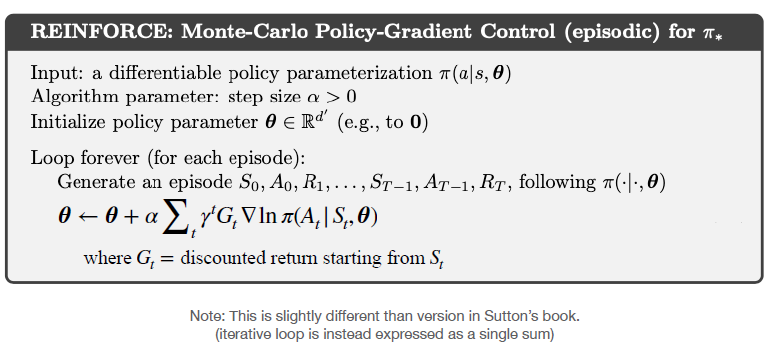
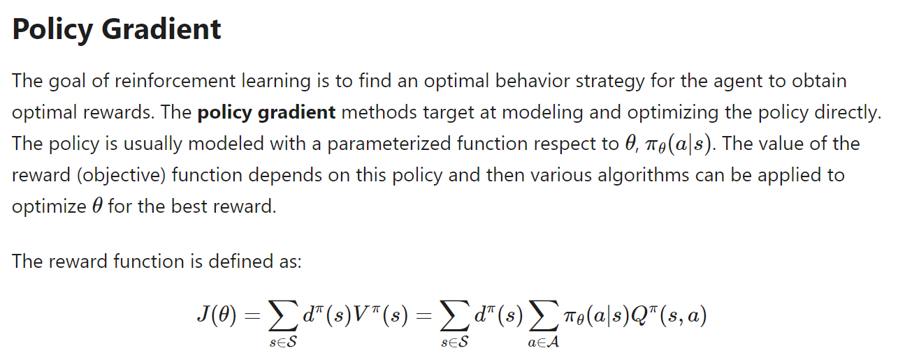
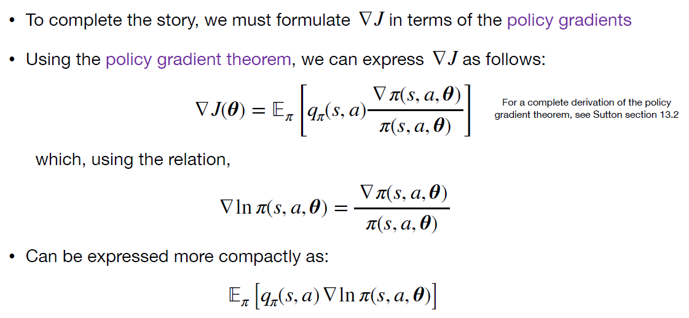
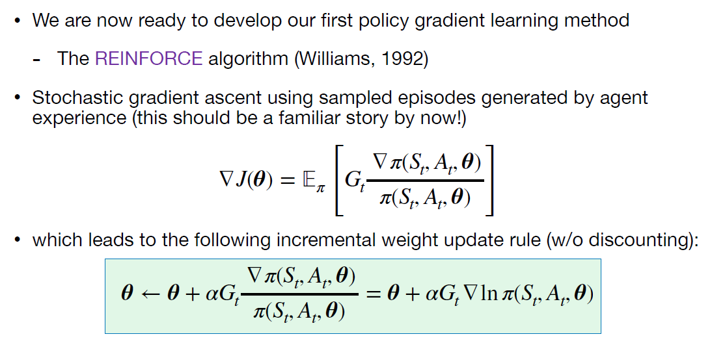

# HW10

## Question

1. Rename pg_mc_skel.py -> pg_mc.py
2. Implement the missing code in pg_mc.py. That is, implement the REINFORCE algorithm
3. Test your code using pg_mc_demo.py

  

## Policy gradient

- Policy gradient methods seek to maximize the performance objective by
gradient ascent (essentially, the inverse of gradient descent minimization)

  

$$
\theta \leftarrow \theta + \alpha \widehat{\nabla	J(\theta)}
$$

- $\alpha$ is a step-size parameter (learning rate)
- $\widehat{\nabla	J(\theta)}$ is a stochastic
estimate

  

  

  

- REINFORCE is an on-policy algorithm  
- REINFORCE is an unbiased Monte Carlo method, therefore:  
  - Guaranteed to converge to (at least) a local maximum  
  - But, also high variance, which may lead to slow learning  
- REINFORCE is an episodic method:  
  - Must generate complete episodes & returns before performing updates  

## Reference

[1] [Policy Gradient Algorithms](https://lilianweng.github.io/posts/2018-04-08-policy-gradient/)

[2] [如何在 Markdown 輸入數學公式及符號](https://blog.maxkit.com.tw/2020/02/markdown.html)