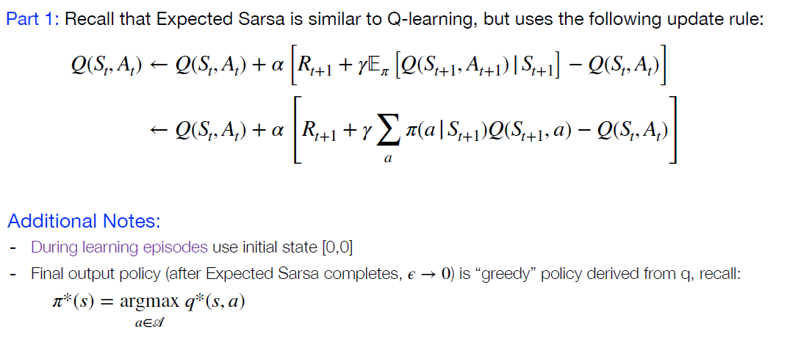
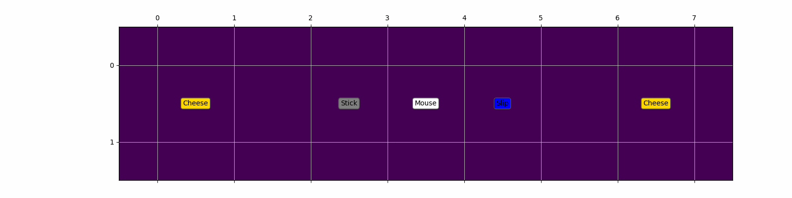
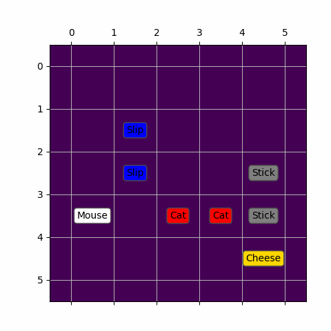

# Hw5
## Question
<p align="middle">
  
</p>

<p align="middle">
  
</p>

<p align="middle">
  
</p>

## part 1 gif
<p align="middle">
  
</p>
<p align="middle">
  
</p>

## part 2 gif
<p align="middle">
  
</p>
<p align="middle">
  
</p>
<p align="middle">
  
</p>

## part 3 gif
<p align="middle">
  
</p>
<p align="middle">
  
</p>
<p align="middle">
  
</p>

## part 4 gif
<p align="middle">
  
</p>

## Ref
```
從根本學習Reinforcement Learning 系列
https://ithelp.ithome.com.tw/users/20129922/ironman/3342
```