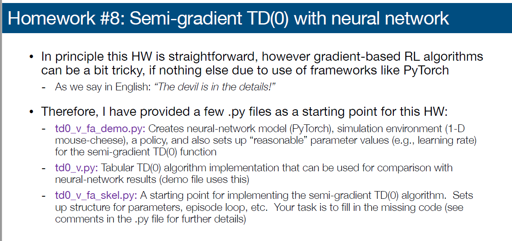

# Hw7
## Question

  

  

## Result

1. num_tiles_7

  

2. num_tiles_17

  

3. num_tiles_27

  

## Ref

[1] [强化学习系列（十二）：Eligibility Traces](https://blog.csdn.net/LagrangeSK/article/details/82556644 ) 

[2] [[Python教學] @property是什麼? 使用場景和用法介紹](https://www.maxlist.xyz/2019/12/25/python-property/)