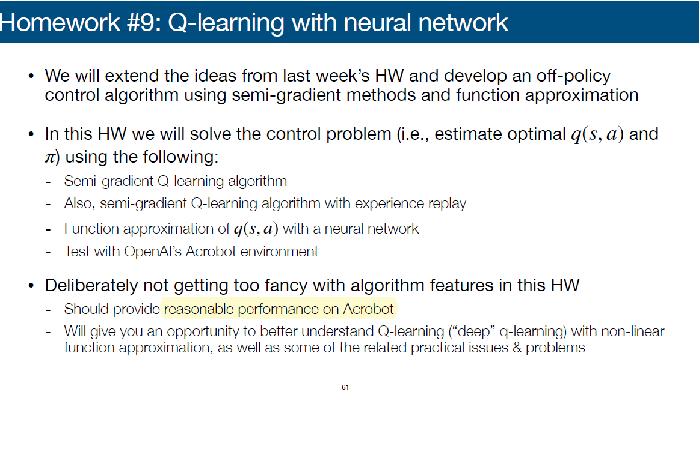
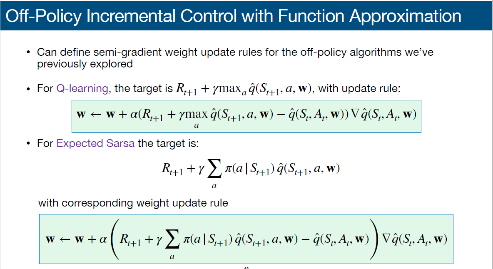
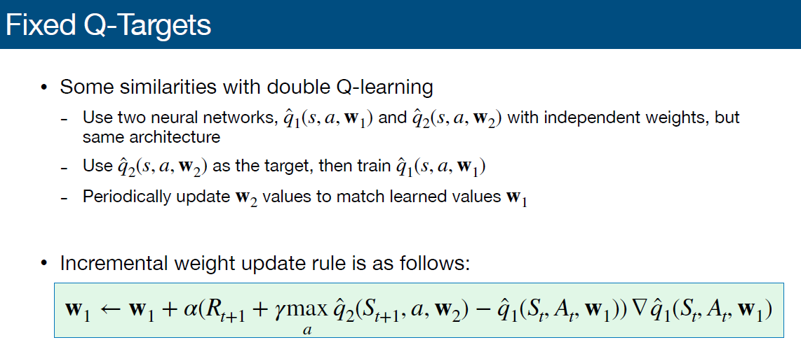
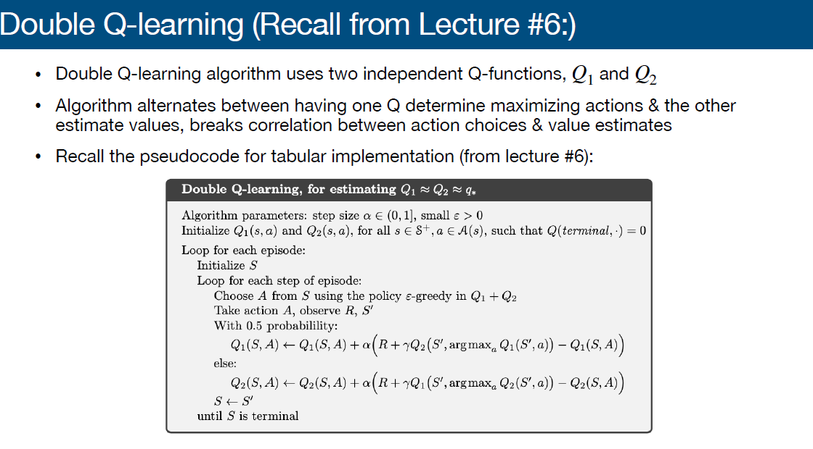
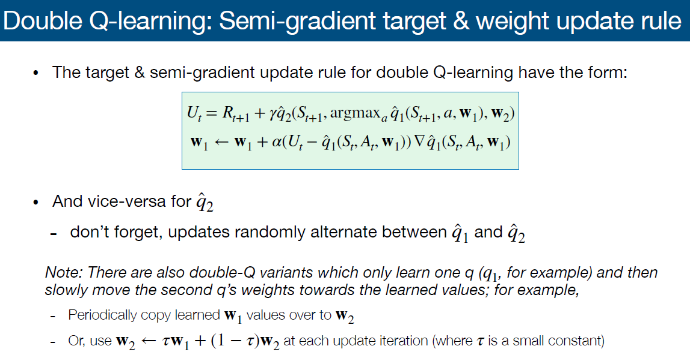
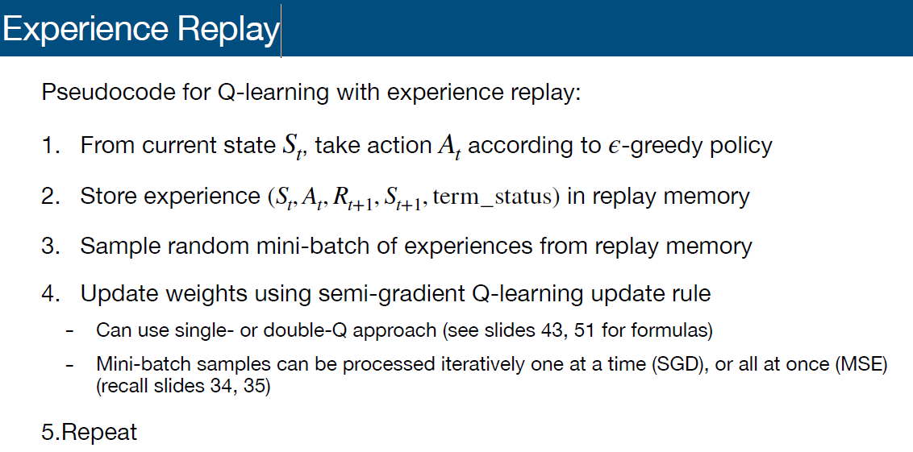
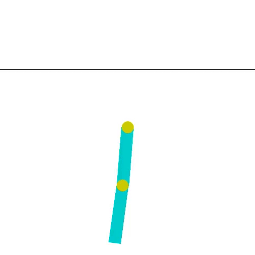

# HW9

## Question

  

## Off-Policy Control with Value Function Approximation

  

## Various ways to solve the stable issue
- Double learning
- Target networks (Fixed Q-targets)
- Experience replay

## Off-Policy Stability - The Deadly Triad
- Function Approximation
- Bootstrapping
- Off-Policy Training

## Fixed Q-Targets

  

## Double_Q

  

  

## Experience Replay

  

  

## Result

  

